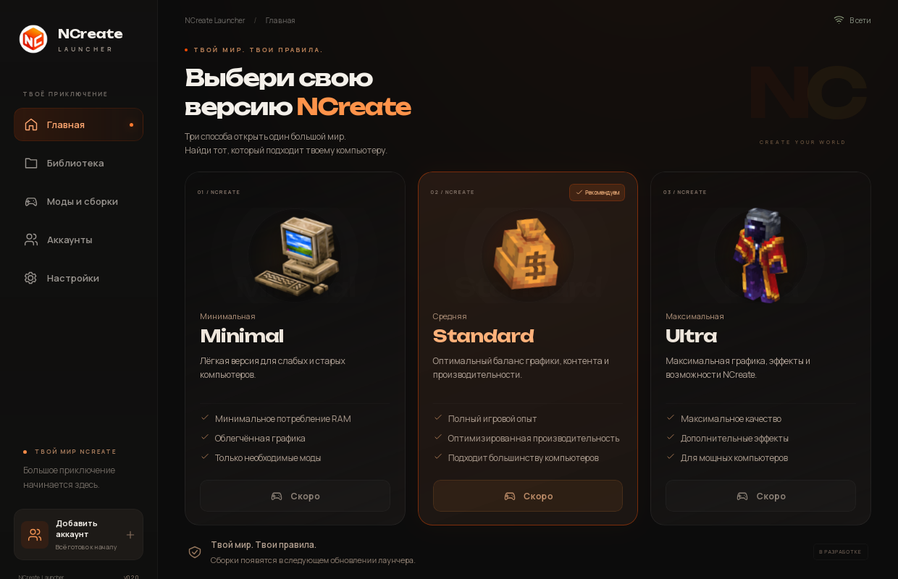
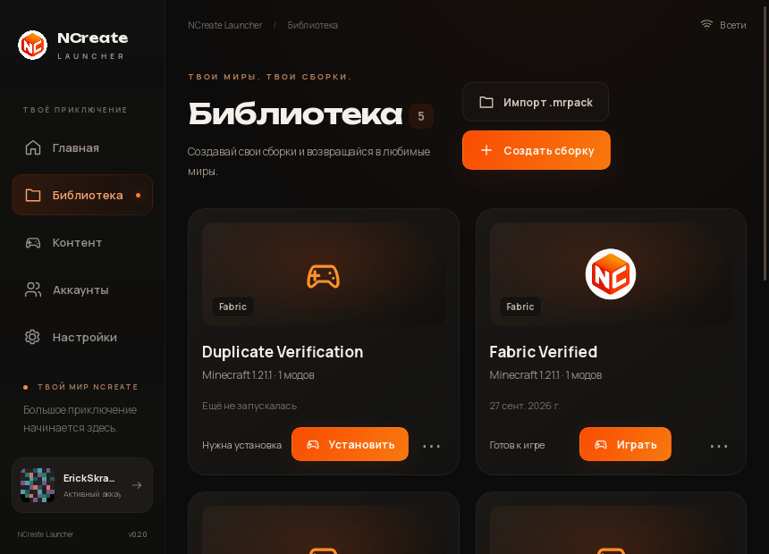
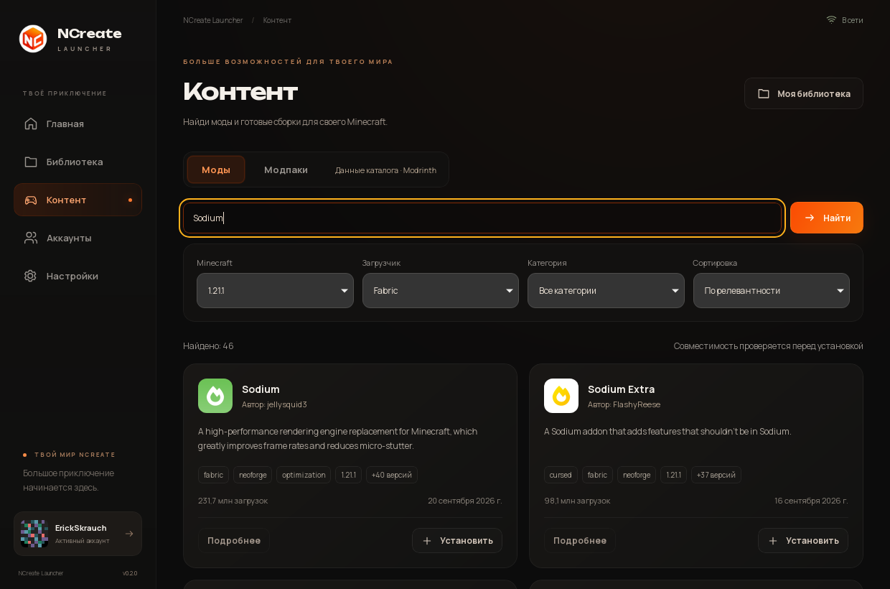
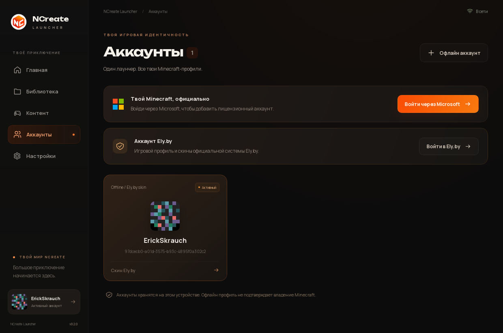
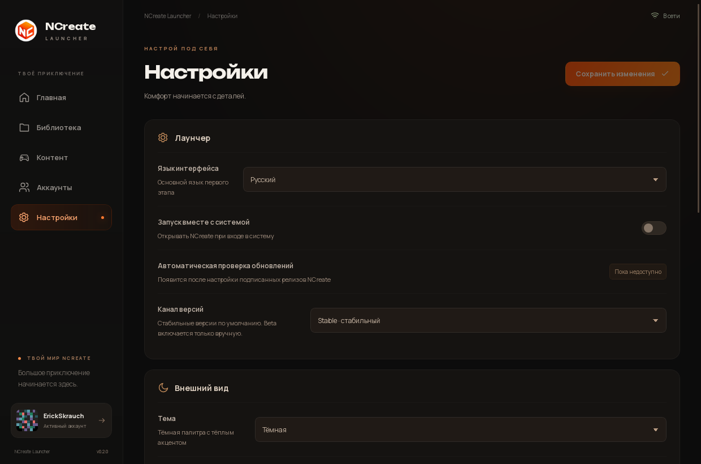

<p align="center">
  <a href="README.md">Русский</a> •
  <strong>English</strong>
</p>

<div align="center">
  
  <h1>NCreate Launcher v0.5.0 Beta</h1>
  <p>A desktop Minecraft launcher for the NCreate project on Windows and Linux.</p>
  <p>
    
    <a href="https://github.com/Yozekkk/ncreate-launcher/releases/latest"></a>
    
    
    <a href="https://github.com/Yozekkk/ncreate-launcher/actions/workflows/check.yml"></a>
  </p>
  <p>
    
    
    
    <a href="LICENSE"></a>
  </p>
</div>

## Download

> [!IMPORTANT]
> **v0.5.0 Beta** is a functional launcher with a Minecraft Library, game installation, and a mod catalog. The official Minimal, Standard, and Ultra editions are still unavailable; other limitations are listed below. Windows and Linux installers are published and SHA-256 verified.

| Platform                                                                    | v0.5.0 Beta file                   | Download                                                                                                                          |
| :-------------------------------------------------------------------------- | :--------------------------------- | :-------------------------------------------------------------------------------------------------------------------------------- |
| **Windows 10/11 x64**                                                       | `NCreate-Launcher-Setup-0.5.0.exe` | **[Download for Windows](https://github.com/Yozekkk/ncreate-launcher/releases/download/v0.5.0/NCreate-Launcher-Setup-0.5.0.exe)** |
| **Linux x64** — EndeavourOS, Arch, Manjaro, Fedora, and other distributions | `NCreate-Launcher-0.5.0.AppImage`  | **[Download AppImage](https://github.com/Yozekkk/ncreate-launcher/releases/download/v0.5.0/NCreate-Launcher-0.5.0.AppImage)**     |
| **Debian, Ubuntu, Linux Mint**, and compatible systems                      | `NCreate-Launcher-0.5.0-amd64.deb` | **[Download DEB](https://github.com/Yozekkk/ncreate-launcher/releases/download/v0.5.0/NCreate-Launcher-0.5.0-amd64.deb)**         |

[v0.5.0 release notes](https://github.com/Yozekkk/ncreate-launcher/releases/tag/v0.5.0) · [All releases](https://github.com/Yozekkk/ncreate-launcher/releases) · [SHA-256 checksums](https://github.com/Yozekkk/ncreate-launcher/releases/download/v0.5.0/SHA256SUMS.txt)

## What's new in v0.5.0

Compared with v0.1.0, the launcher now has a Minecraft Library and access to the public mod catalog. The list below distinguishes verified features from their testing limits.

- **Library:** separate Minecraft instances, creation, renaming, duplication, and `.mrpack` import and export.
- **Game runtime:** Vanilla and Fabric installation and launch were verified on Linux. Forge installation and its running game process were also checked; Quilt and NeoForge have verification limits noted below.
- **Mods and modpacks:** public Modrinth catalog, search, compatible installation, and mod enable, disable, removal, update, and rollback.
- **Accounts:** local profiles, Microsoft and Ely.by sign-in protocols, and public Ely.by skins.
- **NCreate groundwork:** separate manifests, file verification, download management, and recovery after failed updates. The official Minimal, Standard, and Ultra editions are still unavailable.

Feature checks are detailed in the [Stage 2 verification report](docs/STAGE2-VERIFICATION.md). A successful sign-in with a real Microsoft or Ely.by account still requires an owner test.

## Preview

These are real Linux desktop captures from the current `main` branch.

<p align="center">
  
</p>

<table>
  <tr>
    <td width="50%"></td>
    <td width="50%"></td>
  </tr>
  <tr><td align="center">Library</td><td align="center">Mods and modpacks</td></tr>
  <tr>
    <td></td>
    <td></td>
  </tr>
  <tr><td align="center">Accounts</td><td align="center">Settings</td></tr>
</table>

## Features

Version 0.5.0 includes separate Minecraft instances, mod and modpack discovery, local accounts, and settings. The Library and catalog use the NCreate interface; advertising and a Modrinth account are not required.

## Library

You can create separate Vanilla, Fabric, Forge, and Quilt instances. You can rename, duplicate, delete, import, and export them as `.mrpack` files. Each instance has its own mods, memory setting, and Java path. NeoForge selection is also present, but an end-to-end launch has not been verified; compatible versions depend on available loader metadata.

## Mods and modpacks

The launcher uses the public Modrinth catalog to find mods and modpacks. You can install a compatible version into an instance, manage installed mods, and import a `.mrpack` as a new instance. Updating and rolling back an individual mod have been verified. Automatic **whole-modpack version updates** are not implemented yet.

Modrinth is a content source here. **NCreate Launcher is not the official Modrinth App** and does not require a Modrinth account to browse public content.

## Accounts

| Type          | Support in v0.5.0 Beta                                                                                                                                                                    |
| :------------ | :---------------------------------------------------------------------------------------------------------------------------------------------------------------------------------------- |
| **Offline**   | Local nickname and stable deterministic UUID. Creation, switching, and persistence across restart were verified.                                                                          |
| **Microsoft** | The official OAuth/Minecraft flow is implemented. Technical checks and a complete synthetic pipeline passed, but a successful sign-in with an owner's real account has not been verified. |
| **Ely.by**    | The sign-in protocol and skin support are implemented. Public skin lookup and fallback were checked live; successful sign-in with a real Ely.by account remains unverified.               |

Offline and Ely.by profiles do not grant access to servers that require a licensed Microsoft account. See the [Stage 2 verification report](docs/STAGE2-VERIFICATION.md) for the evidence boundaries.

## Official NCreate editions

Minimal, Standard, and Ultra remain distinct NCreate editions. Their cards appear on Home, but installation buttons are disabled: **the official NCreate packs are still in preparation**. Manifest and update handling passed fixture tests; production manifests have not been published.

The public v0.5.0 binary has no self-updater. The current `main` branch prepares a signed updater with Stable/Beta channels; it will become active after the next signed release. Users of the installed v0.5.0 build will need to download that installer once. Official packs will be discovered through the [separate manifest repository](https://github.com/Yozekkk/ncreate-manifests) when real releases are published there.

## Installation

Choose the v0.5.0 package for your system in the table above and install it as follows.

### Windows 10/11 x64

Download the `.exe`, run the installer, and open NCreate Launcher. The beta installer does not yet have a commercial code-signing certificate, so Windows SmartScreen may warn you. Check the download source and checksum; keep Windows security protection enabled. Windows CI builds NSIS, but installation and GUI behavior on a physical Windows machine have not been verified.

### Linux AppImage

AppImage is the recommended portable option for EndeavourOS, Arch Linux, Manjaro, Fedora, and other modern distributions. After downloading the file, run:

```bash
chmod +x NCreate-Launcher-0.5.0.AppImage
./NCreate-Launcher-0.5.0.AppImage
```

If the file is in `~/Downloads`, first run `cd ~/Downloads`.

If your system lacks FUSE 2, use `APPIMAGE_EXTRACT_AND_RUN=1 ./NCreate-Launcher-0.5.0.AppImage`.

### Debian, Ubuntu, and Linux Mint

The DEB package is for Debian/Ubuntu-based systems. After downloading the file, install it with:

```bash
cd ~/Downloads
sudo apt install ./NCreate-Launcher-0.5.0-amd64.deb
```

Choose AppImage instead of DEB on EndeavourOS and Arch.

### Verify a download

Download `SHA256SUMS.txt` from the same release and compare your file's hash with its entry. For the v0.5.0 AppImage on Linux:

```bash
sha256sum NCreate-Launcher-0.5.0.AppImage
```

For the v0.5.0 installer on Windows:

```powershell
Get-FileHash .\NCreate-Launcher-Setup-0.5.0.exe -Algorithm SHA256
```

## First launch

After installation:

1. Open NCreate Launcher and add a profile in **Accounts**.
2. Create a Minecraft instance in **Library**, or import a `.mrpack`.
3. Find compatible mods in **Mods and modpacks** if you want them.
4. Install Minecraft for the selected instance, then select **Play**.

## System requirements

- Windows 10/11 x64 or Linux x64; Windows GUI behavior still needs a direct test.
- Free space for Minecraft and your selected mods; the amount depends on the game version and content.
- Internet access for the first game, loader, and content downloads.
- A Java version compatible with your Minecraft version. The launcher checks installed Java and accepts a custom executable path; managed Java downloads are not implemented yet.

## Privacy

The app has no advertising or telemetry sent to Modrinth, PostHog, or Sentry. Account metadata and settings stay in a separate NCreate data directory; existing Modrinth App data is not imported. Microsoft and Ely.by tokens are stored in the operating system's credential store and are not sent to the frontend. Passwords are not saved: an Ely.by password, when required for sign-in, is used only during that request. See the [network audit](docs/NETWORK.md).

## Development

You need Node.js 22.12+, pnpm 10.30.3, stable Rust, and the [Tauri Linux prerequisites](docs/DEVELOPMENT.md).

```bash
git clone https://github.com/Yozekkk/ncreate-launcher.git
cd ncreate-launcher
pnpm install --frozen-lockfile
pnpm app:dev
```

Build Linux AppImage and DEB packages with:

```bash
pnpm app:build --bundles appimage,deb
```

On Windows, use `pnpm app:build --bundles nsis`. See the [development guide](docs/DEVELOPMENT.md) for details.

## Documentation

- [Development and packaging](docs/DEVELOPMENT.md)
- [Network and privacy](docs/NETWORK.md)
- [Stage 2 architecture](docs/STAGE2-ARCHITECTURE.md)
- [Stage 2 verification](docs/STAGE2-VERIFICATION.md)
- [Requirements and limitations](docs/REQUIREMENTS.md)
- [Release process](docs/RELEASE.md)
- [Launcher and official pack updates](docs/UPDATES.md)
- [Upstream source audit](docs/UPSTREAM-AUDIT.md)
- [v0.5.0 release notes](docs/releases/v0.5.0.en.md)

## License and credits

NCreate Launcher uses modified portions of the open-source [Modrinth App](https://github.com/modrinth/code) under [GPLv3](LICENSE). Original notices and attribution remain in [NOTICE.md](NOTICE.md), [COPYING.md](COPYING.md), and the [upstream audit](docs/UPSTREAM-AUDIT.md). NCreate owns its branding. This project is not affiliated with Mojang or Microsoft.
