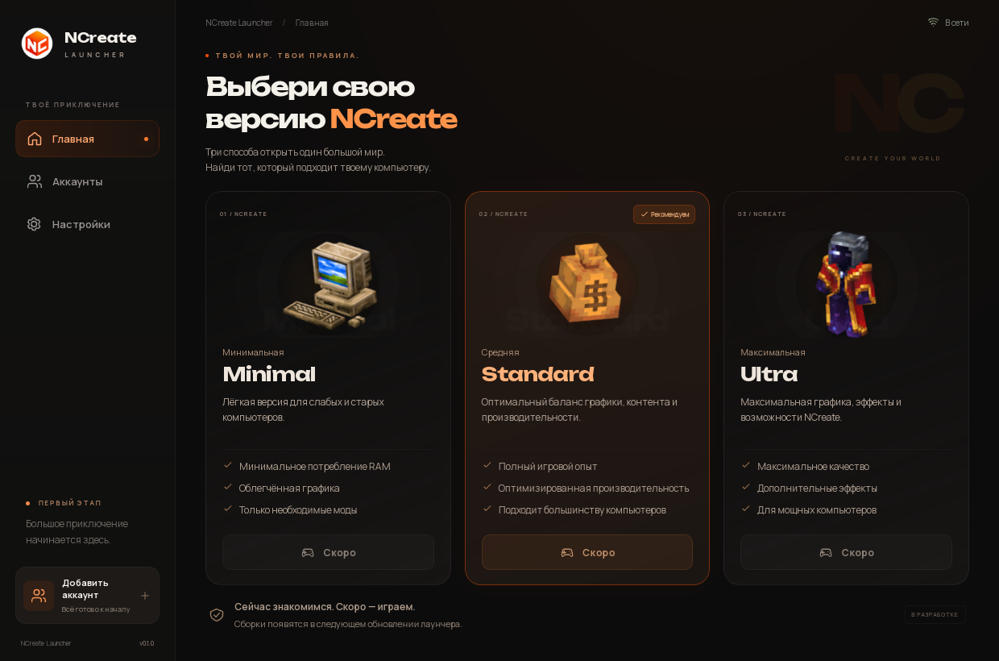
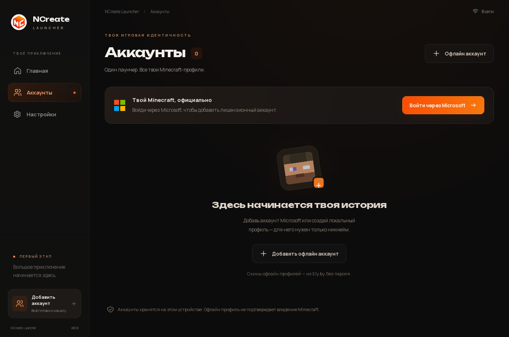
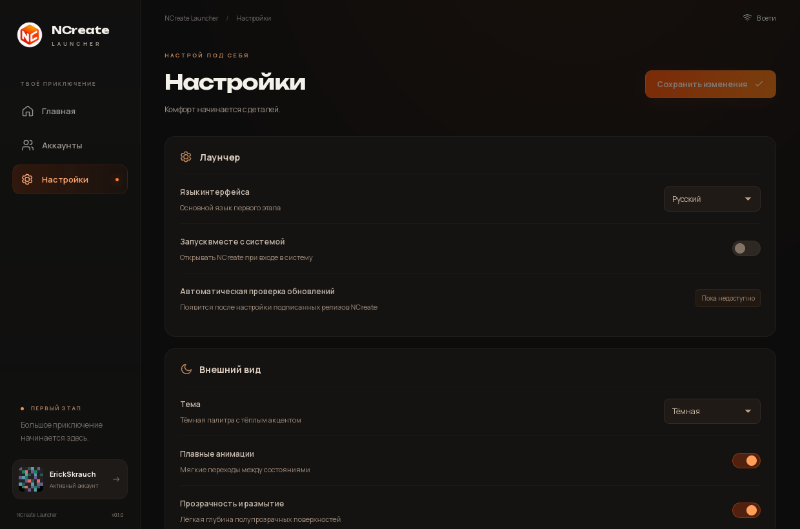

<div align="center">
  
  <h1>NCreate Launcher</h1>
  <p>Official desktop launcher for NCreate</p>
  <p>
    <a href="https://github.com/Yozekkk/ncreate-launcher/releases/latest"></a>
    
    
    
    
    
    <a href="LICENSE"></a>
    <a href="https://github.com/Yozekkk/ncreate-launcher/actions/workflows/check.yml"></a>
  </p>
</div>

Manage your Minecraft profiles and get ready for the NCreate ecosystem in a native Windows and Linux application. The current interface is in Russian.

## Download

| Platform                     | Package                                                | Download                                                                                                                          |
| :--------------------------- | :----------------------------------------------------- | :-------------------------------------------------------------------------------------------------------------------------------- |
| **Windows 10/11 x64**        | Installer · recommended for most Windows users         | **[Download for Windows](https://github.com/Yozekkk/ncreate-launcher/releases/download/v0.1.0/NCreate-Launcher-Setup-0.1.0.exe)** |
| **Linux x64**                | AppImage · recommended, including EndeavourOS and Arch | **[Download AppImage](https://github.com/Yozekkk/ncreate-launcher/releases/download/v0.1.0/NCreate-Launcher-0.1.0.AppImage)**     |
| Debian / Ubuntu / Linux Mint | DEB package · for Debian/Ubuntu-based distributions    | **[Download DEB](https://github.com/Yozekkk/ncreate-launcher/releases/download/v0.1.0/NCreate-Launcher-0.1.0-amd64.deb)**         |

[Latest release and release notes](https://github.com/Yozekkk/ncreate-launcher/releases/latest) · [SHA-256 checksums](https://github.com/Yozekkk/ncreate-launcher/releases/download/v0.1.0/SHA256SUMS.txt)

> [!IMPORTANT]
> **v0.1.0 Beta:** Minecraft installation and game launch are not available yet. Minimal, Standard and Ultra are previews with disabled launch buttons. Automatic updates are disabled. Microsoft sign-in reaches the official login flow; verification with a real account is still pending.

## Preview



<table>
  <tr>
    <td width="50%"></td>
    <td width="50%"></td>
  </tr>
  <tr><td align="center">Accounts</td><td align="center">Settings</td></tr>
</table>

## Features

- Native Windows and Linux desktop application, built with Tauri, Rust and Vue.
- Saved offline Minecraft profiles with active-account switching.
- Microsoft Minecraft account flow through the official browser login.
- Ely.by skin previews for offline profiles, with a local fallback.
- Minimal, Standard and Ultra edition previews.
- Local settings and account persistence.
- No advertising, telemetry or Modrinth account dependency.

## Installation

### Windows 10/11 x64

1. Download `NCreate-Launcher-Setup-0.1.0.exe` above.
2. Run the installer.
3. Open **NCreate Launcher**.

The beta installer does not have a commercial code-signing certificate. Windows SmartScreen may display a warning. Verify the download source and checksum before deciding whether to continue; keep Windows security protection enabled. The installer was built by Windows CI, but installation and GUI testing on Windows are not yet confirmed.

### Linux AppImage

The AppImage is a portable Linux build: download it, make it executable and run it. No package installation is required.

```bash
chmod +x NCreate-Launcher-0.1.0.AppImage
./NCreate-Launcher-0.1.0.AppImage
```

Use this package for EndeavourOS and Arch. If your system lacks FUSE 2, use `APPIMAGE_EXTRACT_AND_RUN=1 ./NCreate-Launcher-0.1.0.AppImage` or install your distribution's FUSE 2 package.

### Debian, Ubuntu and Linux Mint

Download `NCreate-Launcher-0.1.0-amd64.deb`, then install it from the download directory:

```bash
sudo apt install ./NCreate-Launcher-0.1.0-amd64.deb
```

The DEB package is for Debian/Ubuntu-based distributions. Use the AppImage on EndeavourOS and Arch.

### Verify a download

Download `SHA256SUMS.txt` from the release into the same directory as your installer. On Linux, verify an individual file:

```bash
sha256sum NCreate-Launcher-0.1.0.AppImage
```

Compare the result with its line in `SHA256SUMS.txt`. On Windows, use PowerShell:

```powershell
Get-FileHash .\NCreate-Launcher-Setup-0.1.0.exe -Algorithm SHA256
```

## Account support

| Account      | Current support                                                                                                                                                                                                |
| :----------- | :------------------------------------------------------------------------------------------------------------------------------------------------------------------------------------------------------------- |
| Offline      | Add a nickname, save a local profile, switch accounts, rename or remove it. Renaming changes its deterministic Minecraft UUID.                                                                                 |
| Ely.by skins | Look up an offline nickname's public skin without an Ely.by password. Missing or unavailable skins use a local fallback.                                                                                       |
| Microsoft    | Official browser sign-in and Minecraft authentication pipeline. Full sign-in, profile persistence and refresh with a real account still need verification. Tokens use the operating system's credential store. |

Offline profiles do not grant access to servers that require a licensed Microsoft Minecraft account. Skin previews do not yet inject skins into a running game.

## NCreate editions

| Edition  | Intended experience                                       | Beta status |
| :------- | :-------------------------------------------------------- | :---------- |
| Minimal  | Lightweight edition for older and lower-powered computers | Coming soon |
| Standard | Recommended balance of content, graphics and performance  | Coming soon |
| Ultra    | Higher visual quality for powerful computers              | Coming soon |

Official pack manifests, download and launch support will arrive in a later release. No third-party packs are installed.

> **Stage 2 development:** the current source adds a custom instance library, public Modrinth content and a managed edition engine. The public downloads above remain v0.1.0 Beta. See [Stage 2 architecture](docs/STAGE2-ARCHITECTURE.md) and [verification](docs/STAGE2-VERIFICATION.md) for source-build support and limitations.

## Development

Requires Node.js 22.12+, pnpm 10.30.3, stable Rust and the [Linux desktop prerequisites](docs/DEVELOPMENT.md).

```bash
git clone https://github.com/Yozekkk/ncreate-launcher.git
cd ncreate-launcher
pnpm install --frozen-lockfile
pnpm app:dev
```

Build Linux installers:

```bash
pnpm app:build --bundles appimage,deb
```

Output: `target/release/bundle/appimage/` and `target/release/bundle/deb/`. Windows builds use `pnpm app:build --bundles nsis` on Windows. Read the [development guide](docs/DEVELOPMENT.md) for architecture, checks and packaging details. For contributions, keep changes focused, preserve license notices and run the documented checks.

## Documentation

- [Development and architecture](docs/DEVELOPMENT.md)
- [Requirements and implementation status](docs/REQUIREMENTS.md)
- [Verification evidence and remaining limitations](docs/VERIFICATION.md)
- [Network and privacy audit](docs/NETWORK.md)
- [Release builds and updater setup](docs/RELEASE.md)
- [Upstream audit](docs/UPSTREAM-AUDIT.md)

## Privacy

Accounts and settings stay on your device. Linux data lives in `~/.local/share/ncreate-launcher/`; Windows data lives in `%LOCALAPPDATA%\ncreate-launcher\`. Microsoft tokens use the native credential store. No passwords are collected by the launcher, and no telemetry is sent. Existing Modrinth App user data is not read or migrated. See the [network audit](docs/NETWORK.md) for authentication and skin-service endpoints.

## License and credits

NCreate Launcher uses and modifies portions of the open-source [Modrinth App codebase](https://github.com/modrinth/code) under [GPLv3](LICENSE). Copyright notices and attribution are preserved in [NOTICE.md](NOTICE.md), [COPYING.md](COPYING.md) and the [upstream audit](docs/UPSTREAM-AUDIT.md). Corresponding source code accompanies the release. This software comes without warranty.

NCreate branding belongs to the NCreate project. This is not an official Minecraft product and is not affiliated with Mojang or Microsoft.
