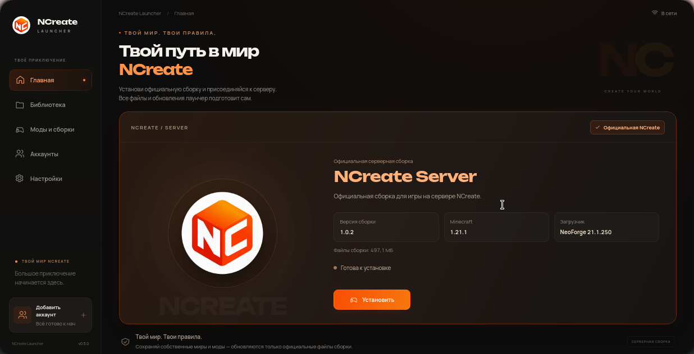

<p align="center">
  <strong>Русский</strong> •
  <a href="README.en.md">English</a>
</p>

<div align="center">
  
  <h1>NCreate Launcher v0.6.0 Beta</h1>
  <p>Десктопный Minecraft-лаунчер проекта NCreate для Windows и Linux.</p>
  <p>
    
    <a href="https://github.com/Yozekkk/ncreate-launcher/releases/tag/v0.6.0"></a>
    
    
    <a href="https://github.com/Yozekkk/ncreate-launcher/actions/workflows/check.yml"></a>
  </p>
  <p>
    
    
    
    <a href="LICENSE"></a>
  </p>
</div>

## Скачать

> [!IMPORTANT]
> **v0.6.0 Beta** — первая версия с официальной сборкой **NCreate Server 1.0.2**. Установите её с Главной страницы: лаунчер загрузит Minecraft, NeoForge, моды и конфигурации. Для перехода с v0.5.0 новый установщик нужно запустить вручную один раз; последующие подписанные обновления проверяются в самом лаунчере.

| Платформа                                                                | Файл v0.6.0 Beta                   | Скачать                                                                                                                          |
| :----------------------------------------------------------------------- | :--------------------------------- | :------------------------------------------------------------------------------------------------------------------------------- |
| **Windows 10/11 x64**                                                    | `NCreate-Launcher-Setup-0.6.0.exe` | **[Скачать для Windows](https://github.com/Yozekkk/ncreate-launcher/releases/download/v0.6.0/NCreate-Launcher-Setup-0.6.0.exe)** |
| **Linux x64** — EndeavourOS, Arch, Manjaro, Fedora и другие дистрибутивы | `NCreate-Launcher-0.6.0.AppImage`  | **[Скачать AppImage](https://github.com/Yozekkk/ncreate-launcher/releases/download/v0.6.0/NCreate-Launcher-0.6.0.AppImage)**     |
| **Debian, Ubuntu, Linux Mint** и совместимые системы                     | `NCreate-Launcher-0.6.0-amd64.deb` | **[Скачать DEB](https://github.com/Yozekkk/ncreate-launcher/releases/download/v0.6.0/NCreate-Launcher-0.6.0-amd64.deb)**         |

[Заметки релиза v0.6.0](https://github.com/Yozekkk/ncreate-launcher/releases/tag/v0.6.0) · [Все релизы](https://github.com/Yozekkk/ncreate-launcher/releases) · [SHA-256 контрольные суммы](https://github.com/Yozekkk/ncreate-launcher/releases/download/v0.6.0/SHA256SUMS.txt)

## Что нового в v0.6.0

В этом выпуске официальная серверная сборка стала доступна прямо в лаунчере. Библиотека пользовательских экземпляров и каталог модов сохранены.

- **Библиотека:** отдельные экземпляры Minecraft, создание, переименование, дублирование, импорт и экспорт `.mrpack`.
- **Игра:** установка и запуск Vanilla, Fabric и процесса Forge проверены в Linux. Для официальной сборки проверены установка NeoForge 21.1.250 и запуск игрового процесса; подключение к серверу отдельно не проверялось. Quilt установлен, но графический запуск отдельно не подтверждён.
- **Моды и сборки:** публичный каталог Modrinth, поиск, совместимая установка модов и сборок, включение, отключение, удаление, обновление и откат модов.
- **Аккаунты:** локальные профили, протоколы входа Microsoft и Ely.by, публичные скины Ely.by.
- **NCreate Server:** одна официальная сборка с опубликованным manifest, проверкой SHA-256, сохранением пользовательских файлов и восстановлением после неудачного обновления. Установка всех 718 управляемых файлов и запуск сборки проверены в Linux.

Проверки отдельных функций описаны в [отчёте Stage 2](docs/STAGE2-VERIFICATION.md). Успешный вход с реальным аккаунтом Microsoft или Ely.by требует отдельной проверки владельцем.

## Скриншоты

Снимки сделаны в настоящем Linux-приложении. Главный экран показывает официальную сборку; остальные экраны отражают сохранённые страницы Библиотеки, каталога, аккаунтов и настроек.

<p align="center">
  
</p>

<table>
  <tr>
    <td width="50%"></td>
    <td width="50%"></td>
  </tr>
  <tr><td align="center">Библиотека</td><td align="center">Моды и сборки</td></tr>
  <tr>
    <td></td>
    <td></td>
  </tr>
  <tr><td align="center">Аккаунты</td><td align="center">Настройки</td></tr>
</table>

## Возможности

В v0.6.0 доступны установка официальной NCreate Server, отдельные экземпляры Minecraft, поиск модов и сборок, аккаунты и настройки. Библиотека и каталог используют интерфейс NCreate; реклама и вход в аккаунт Modrinth не требуются.

## Библиотека

Можно создавать отдельные экземпляры Vanilla, Fabric, Forge, Quilt и NeoForge, менять их название и настройки, дублировать, удалять, импортировать и экспортировать `.mrpack`. Для каждого экземпляра доступны свои моды, объём памяти и путь к Java. Установка и запуск NeoForge 21.1.250 проверены на официальной сборке; совместимость других версий зависит от доступных метаданных загрузчика.

## Моды и сборки

Лаунчер использует публичный каталог Modrinth для поиска модов и сборок. Можно установить совместимую версию в выбранный экземпляр, управлять установленными модами и импортировать `.mrpack` как новый экземпляр. Проверены обновление и откат отдельного мода. Автоматическое обновление **произвольного стороннего modpack** пока не реализовано; официальная NCreate Server обновляется по собственному manifest.

Modrinth здесь — источник контента. **NCreate Launcher не является официальным приложением Modrinth** и не требует аккаунт Modrinth для публичного каталога.

## Аккаунты

| Тип           | Поддержка в v0.6.0 Beta                                                                                                                                                                |
| :------------ | :------------------------------------------------------------------------------------------------------------------------------------------------------------------------------------- |
| **Offline**   | Локальный профиль с никнеймом и постоянным детерминированным UUID; создание, переключение и сохранение после перезапуска проверены.                                                    |
| **Microsoft** | Официальная цепочка входа OAuth/Minecraft реализована; технические проверки и полный синтетический сценарий прошли. Успешный вход с реальным аккаунтом владельца ещё не подтверждён.   |
| **Ely.by**    | Реализованы протокол входа и работа со скинами. Получение публичного скина и резервный вариант проверены с живым сервисом; успешный вход в реальный Ely.by аккаунт ещё не подтверждён. |

Offline и Ely.by профили не дают доступ к серверам, требующим лицензионный Microsoft-аккаунт. Подробные границы проверки — в [отчёте Stage 2](docs/STAGE2-VERIFICATION.md).

## Официальная сборка NCreate Server

Главная страница предлагает одну [серверную сборку NCreate](https://github.com/Yozekkk/ncreate-pack). Её manifest опубликован в канале Stable: Minecraft 1.21.1, NeoForge 21.1.250, 147 модов из проверенных внешних источников, конфигурации и адрес сервера из исходной сборки. Лаунчер скачивает только изменённые управляемые файлы, проверяет их SHA-256 и сохраняет пользовательские моды, миры и настройки при обновлении. Библиотека показывает установленную сборку с отметкой «Официальная NCreate»; свои экземпляры Minecraft по-прежнему доступны.

Для установки сборки и первого запуска требуется Java 21. Лаунчер умеет использовать установленную Java или указанный вручную путь; управляемая загрузка Java пока не реализована. Пользователям v0.5.0 нужно один раз скачать и установить v0.6.0 вручную, поскольку старый бинарный выпуск не содержит механизма самообновления.

## Установка

Выберите файл v0.6.0 для своей системы в таблице выше и установите его по инструкции ниже.

### Windows 10/11 x64

Скачайте `.exe`, запустите установщик и откройте NCreate Launcher. Установщик beta-версии пока не подписан коммерческим сертификатом, поэтому Windows SmartScreen может показать предупреждение. Проверьте источник и контрольную сумму файла; не отключайте защиту Windows. Windows CI собирает NSIS, но установка и GUI на физическом Windows-компьютере ещё не проверены.

### Linux AppImage

AppImage — рекомендуемый переносимый вариант для EndeavourOS, Arch Linux, Manjaro, Fedora и других современных дистрибутивов. После загрузки файла запустите:

```bash
chmod +x NCreate-Launcher-0.6.0.AppImage
./NCreate-Launcher-0.6.0.AppImage
```

Если файл находится в `~/Загрузки`, сначала перейдите туда командой `cd ~/Загрузки`.

Если в системе нет FUSE 2, можно использовать `APPIMAGE_EXTRACT_AND_RUN=1 ./NCreate-Launcher-0.6.0.AppImage`.

### Debian, Ubuntu и Linux Mint

DEB предназначен для Debian/Ubuntu-совместимых систем. После загрузки файла установите его командой:

```bash
cd ~/Загрузки
sudo apt install ./NCreate-Launcher-0.6.0-amd64.deb
```

Для EndeavourOS и Arch выбирайте AppImage, а не DEB.

### Проверка загруженного файла

Скачайте `SHA256SUMS.txt` из того же релиза и сравните хеш файла со строкой в списке. Например, для AppImage v0.6.0 в Linux:

```bash
sha256sum NCreate-Launcher-0.6.0.AppImage
```

В Windows для установщика v0.6.0:

```powershell
Get-FileHash .\NCreate-Launcher-Setup-0.6.0.exe -Algorithm SHA256
```

## Первый запуск

После установки:

1. Откройте NCreate Launcher и добавьте аккаунт в разделе **Аккаунты**.
2. На **Главной** нажмите **Установить** для официальной NCreate Server или создайте свой экземпляр в **Библиотеке**.
3. Дождитесь установки Minecraft, загрузчика и файлов сборки.
4. При необходимости найдите совместимые моды в разделе **Моды и сборки**, затем нажмите **Играть**.

## Системные требования

- Windows 10/11 x64 или Linux x64; работа GUI непосредственно на Windows ещё требует проверки.
- Свободное место для Minecraft и выбранных модов; объём зависит от версии и содержимого.
- Подключение к интернету для первой загрузки игры, загрузчиков и контента.
- Java нужной для выбранной версии Minecraft версии; для NCreate Server требуется Java 21. Лаунчер проверяет установленную Java и допускает собственный путь; автоматическая загрузка Java пока не реализована.

## Приватность

В приложении нет рекламы и отправки телеметрии в Modrinth, PostHog или Sentry. Данные аккаунтов и настроек остаются в отдельном каталоге NCreate; данные оригинального Modrinth App не импортируются. Токены Microsoft и Ely.by хранятся в системном хранилище учётных данных и не передаются в интерфейс. Пароли не сохраняются: пароль Ely.by, если он нужен для входа, используется только во время запроса. Подробнее — в [сетевом аудите](docs/NETWORK.md).

## Разработка

Нужны Node.js 22.12+, pnpm 10.30.3, стабильный Rust и [зависимости Tauri для Linux](docs/DEVELOPMENT.md).

```bash
git clone https://github.com/Yozekkk/ncreate-launcher.git
cd ncreate-launcher
pnpm install --frozen-lockfile
pnpm app:dev
```

Сборка Linux AppImage и DEB:

```bash
pnpm app:build --bundles appimage,deb
```

На Windows используйте `pnpm app:build --bundles nsis`. Подробности — в [руководстве разработчика](docs/DEVELOPMENT.md).

## Документация

- [Разработка и сборка](docs/DEVELOPMENT.md)
- [Сеть и приватность](docs/NETWORK.md)
- [Архитектура Stage 2](docs/STAGE2-ARCHITECTURE.md)
- [Фактические проверки Stage 2](docs/STAGE2-VERIFICATION.md)
- [Требования и ограничения](docs/REQUIREMENTS.md)
- [Публикация релизов](docs/RELEASE.md)
- [Обновления лаунчера и официальных сборок](docs/UPDATES.md)
- [Официальная серверная сборка и её проверка](docs/OFFICIAL-PACK.md)
- [Происхождение исходного кода](docs/UPSTREAM-AUDIT.md)
- [Заметки выпуска v0.6.0](docs/releases/v0.6.0.md)

## Лицензия и авторство

NCreate Launcher использует изменённые части открытого кода [Modrinth App](https://github.com/modrinth/code) на условиях [GPLv3](LICENSE). Исходные уведомления и сведения об авторстве сохранены в [NOTICE.md](NOTICE.md), [COPYING.md](COPYING.md) и [аудите upstream](docs/UPSTREAM-AUDIT.md). Логотип и оформление принадлежат NCreate. Проект не связан с Mojang или Microsoft.
